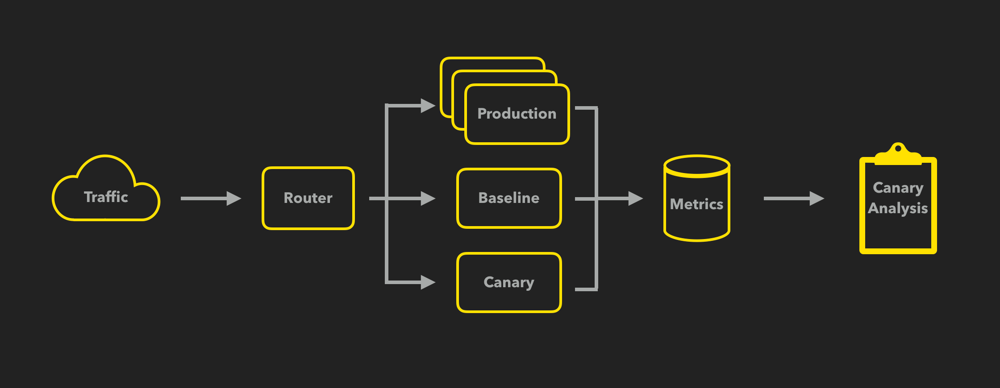
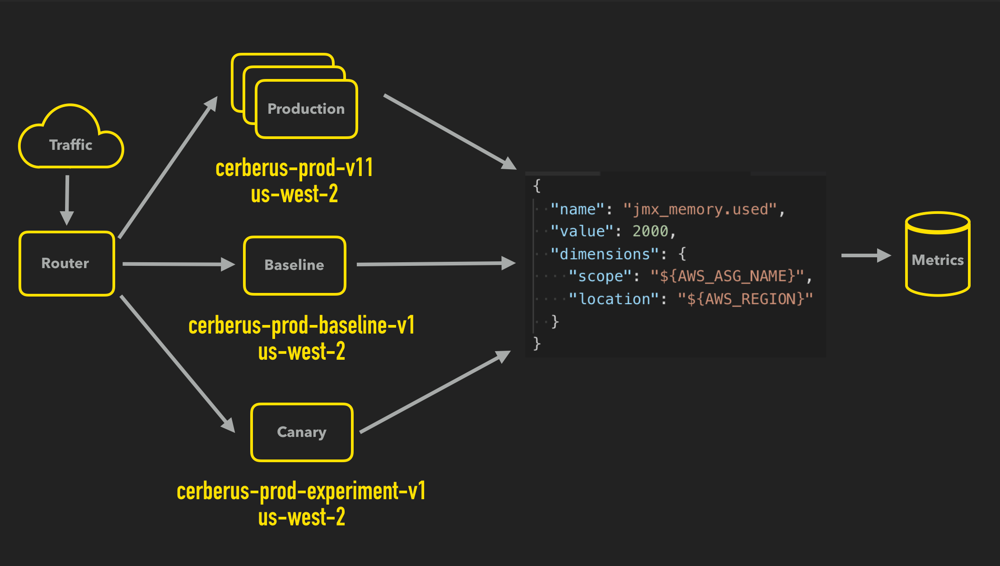

# Instrumenting Application Metrics For Kayenta

The purpose of this doc is to describe how applications need to be configured for their metrics to be usable by Kayenta.

## Define what makes your application healthy

Metrics are a crucial part of canary analysis. They are the indicators of the health of your system that are sent as input to the judge to determine the health of the canary.

Read [Spinnaker Canary Best Practices](https://www.spinnaker.io/guides/user/canary/best-practices/#carefully-choose-the-metrics-to-analyze).

## Report your metrics in a usable way for Kayenta

Now that you have [defined what makes your app healthy](#define-what-makes-your-application-healthy-then-measure-and-report-it), you need to make sure Kayenta can query your metrics.

Kayenta must be able to query the control, experiment and current production [server groups] separately.

Here is a high-level overview of the canary process:

 This image was manipulated from <a href="https://cloud.google.com/blog/products/gcp/introducing-kayenta-an-open-automated-canary-analysis-tool-from-google-and-netflix" target="_blank">"Introducing Kayenta: An open automated canary analysis tool from Google and Netflix".</a> 

You detect the [server group] of the current production and deploy it in a new [server group] as the baseline.
You simultaneously deploy the new change as the canary [server group].

Now, the current production, the baseline, and the canary should all be running and receiving production traffic.
The baseline and experiment should be receiving equal amounts of traffic so that metrics do not need to be converted from counts to rates. 

>For example, comparing error counts across two server groups receiving the same amount of traffic is straightforward.
However, if those two server groups are receiving different amounts of traffic, error counts cannot be directly compared because a server group could have more errors simply because it is receiving more traffic. 
Error counts would have to be converted to proportions based on the percentage of traffic each server group received. 
With other metrics like CPU Usage, conversions to proportions can quickly become unwieldly, so server groups should receive equal traffic to begin with.

It is not enough to only have different [server groups]. They must be reporting their metrics with dimensional metadata to include a unique id that differentiates the [server groups].

When configuring the reporting of your application's metrics, you will need to globally send location and a unique identifier or scope for the [server groups].

Once this is complete, the scope and location metadata can be used to perform canary analysis with Kayenta's APIs.

[server groups]: https://www.spinnaker.io/concepts/#server-group
[server group]: https://www.spinnaker.io/concepts/#server-group
